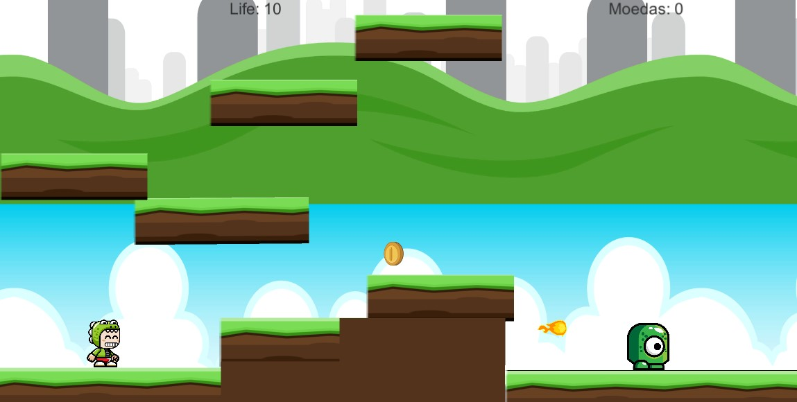

<h1 align="center">
 
  
 
 
</h1>
 

  

Platform game built in unity

## Overview

Game built to be a replica of electronic platform games. Elements such as played, enemy, obstacles, shots, collisions, count of lives and coins, all have been added and tested within the application.

## Building

You'll need [Unity](https://unity.com/pt) installed on your computer in order to build this game.
